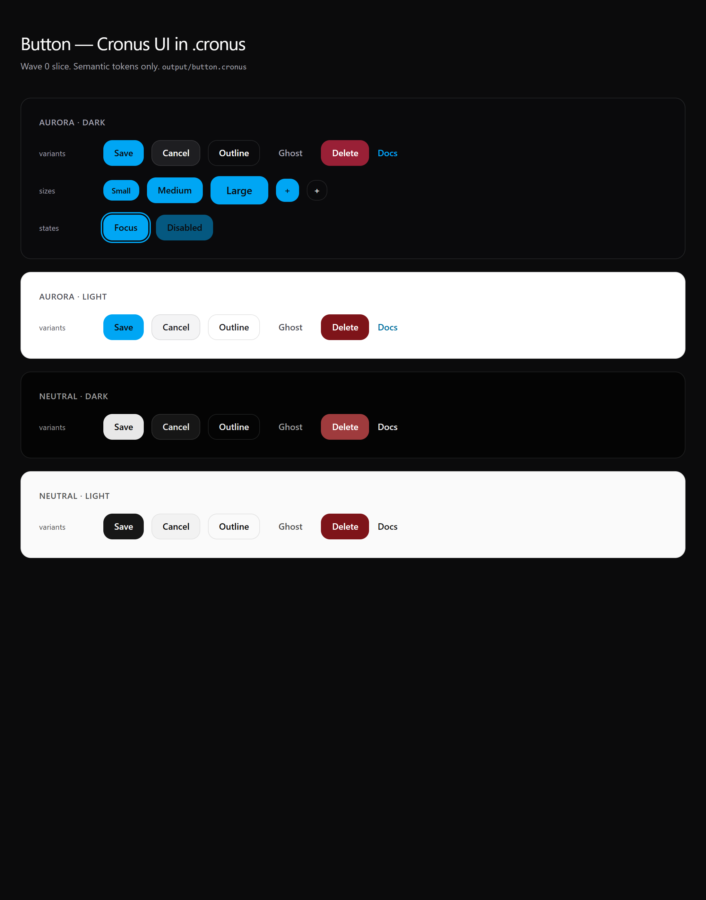
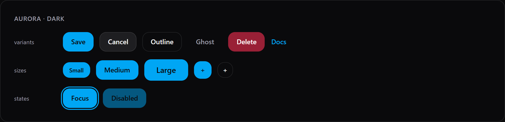
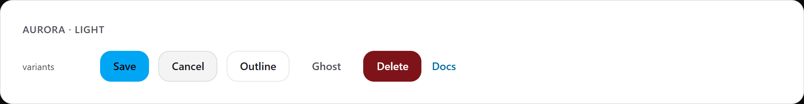
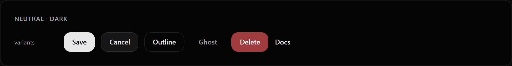
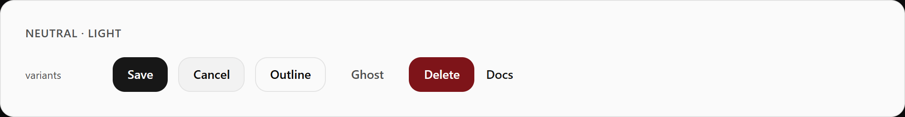

# cronus-ui-in-cronus-language

Cronus UI autorado em `.cronus`. Destino da conversão — não misturar com `cronus-ui` (React) nem `cronus-kernel` (runtime).

Repo: [kwy404/cooud-cronus](https://github.com/kwy404/cooud-cronus)

## Como ficou — Button (Wave 0)

Tokens semânticos `--cronus-*` (aurora / neutral × light / dark). Sem paleta Tailwind.

**Aurora dark** — variantes, sizes, focus ring, disabled:

**Aurora light**

**Neutral dark**

**Neutral light**

Fonte: `output/button.cronus` · preview: `output/preview/button.html`

## O que esta PR contém

- Pack SDD + harness + parity matrix (128 rows)
- `output/button.cronus` (Save / Cancel / Delete / Docs)
- Preview HTML + prints reais (Playwright)
- `cronus-kernel` e `cronus-ui` **não** são commitados aqui

## Testes

Rodados no checkout local do kernel (`ddce3e0`), **antes** de reverter os patches de renderer (o kernel ficou limpo de novo).

| Suite | Resultado |
|---|---|
| `cargo test` (kernel, após W-1) | **220 passed**, 1 failed |
| 11 testes novos W-1 (theme + button + parse demo) | **passed** |
| `dump::detect::tests::test_hero_extraction_developer_landing` | **failed (pré-existente)** — `NotFound` de path no Windows; não é desta conversão |
| `bun run lint` (cronus-ui) | **failed (pré-existente)** — `biome` fora do PATH |
| typecheck / e2e / `cargo build --release` | não rodados |

Testes W-1 que passaram:

- `components::button_parity_tests::*` (6)
- `theme::tests::cronus_ui_css_*` / `css_vars_includes_semantic_and_button_css` (3)
- `parser::parser_tests::parse_button_parity_demo`
- `ui::component::w1_button_tests::inline_primary_component_renders_data_slot`

## Pastas em `Desktop/cooud`

| Pasta | Papel |
|---|---|
| `cronus-ui` | fonte React — leitura |
| `cronus-kernel` | linguagem/runtime — leitura (edição só via PR neste repo) |
| `cronus-ui-in-cronus-language` | conversão `.cronus` |

## Próximo

Input + Label em `output/`, mesmo contrato de tokens.
