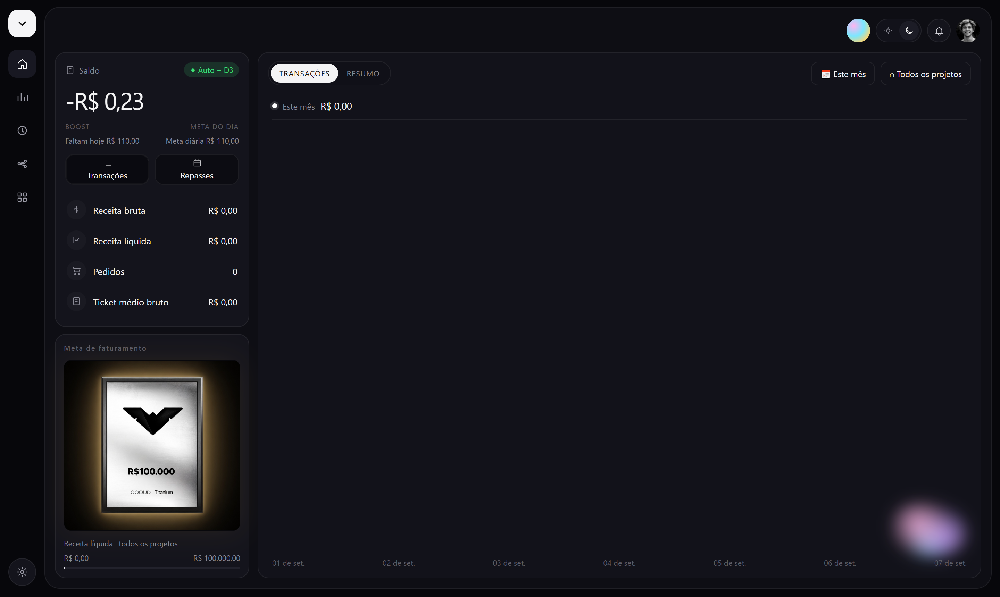
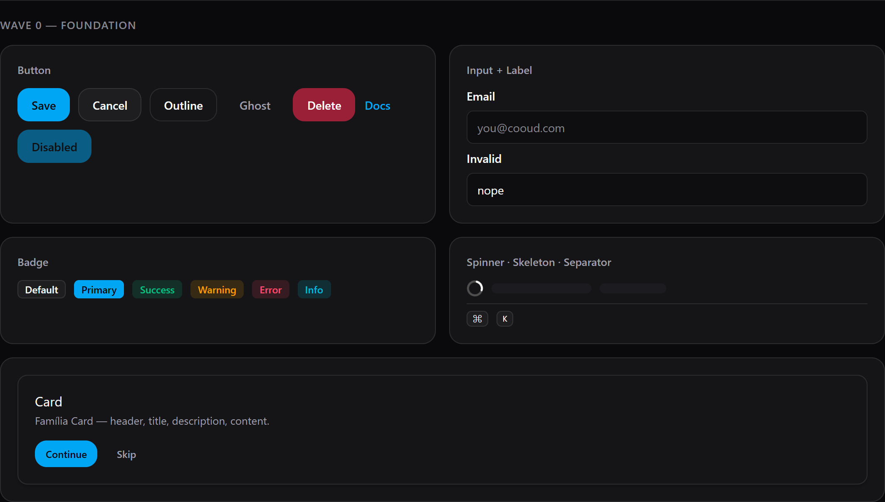
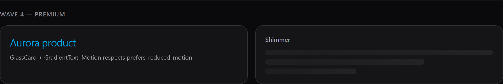

# cooud-cronus

Cronus UI em `.cronus` + dashboard Cooud.

**Não é um app Node.** Não tem `node_modules`. Sem o compilador o `.cronus` é só fonte — não quebra o git, mas não executa.

## Como não quebrar

| Peça | Onde | Como entra no clone |
|---|---|---|
| Pacotes UI | `packages/ui` (58 `.cronus`) | já no git |
| Tokens | `packages/tokens` | já no git |
| App dashboard | `apps/dashboard/app.cronus` | já no git |
| Compilador `cronus` | `compiler/cronus-kernel` → `bin/cronus.exe` | **não** vai no git; `scripts/setup.ps1` clona + `cargo build` |

```powershell
git clone https://github.com/kwy404/cooud-cronus.git
cd cooud-cronus
.\scripts\CRIAR-COMPILER.bat
.\bin\cronus.exe parse .\apps\dashboard\app.cronus
```

Precisa de **Rust** (`https://rustup.rs`) e **Git**. Sem isso o parse não roda — os arquivos `.cronus` continuam no repo.

## Packages (tudo no git)

```
packages/
  tokens/     @cronus-ui/tokens
  theme/      aurora / neutral / midnight / sunset / emerald
  ui/         173 famílias (barrel inteiro do cronus-ui)
  blocks/     307 blocks do registry
  stack/      scaffold nativo
  cli/        → bin/cronus.exe (não npm)
  mcp/        intenção, sem Node
  ai-kit/     doutrina
apps/
  dashboard/  dashboard.cooud.com
compiler/     cronus-kernel (clone no setup)
```

## Cooud Dashboard

`cronus parse apps/dashboard/app.cronus` → App `"Cooud"` · 1 page · port 4747



## Catálogo





