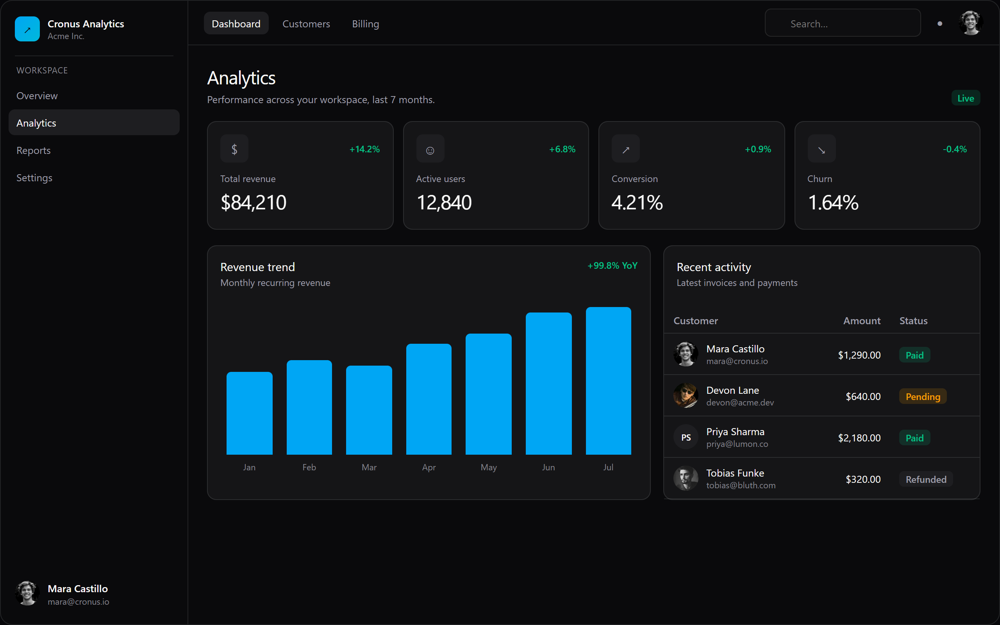
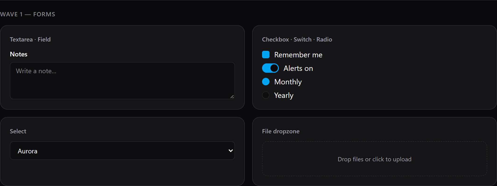
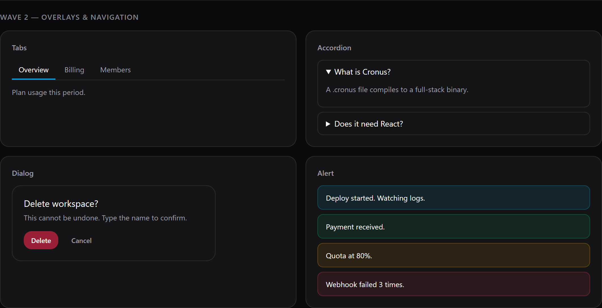
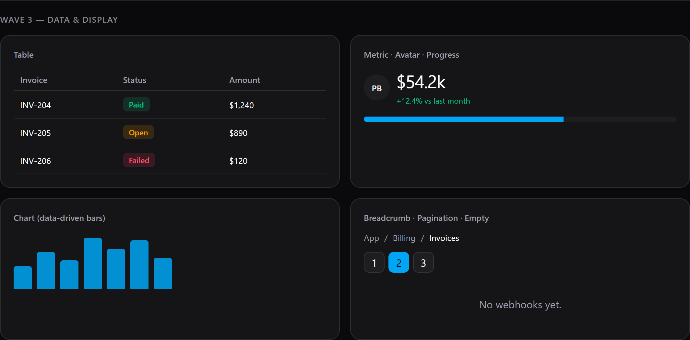

# cronus-ui-in-cronus-language

Cronus UI autorado em `.cronus`. Destino da conversão.

Repo: [kwy404/cooud-cronus](https://github.com/kwy404/cooud-cronus) · **58** famílias em `output/components/` · showcase `output/preview/showcase.html`

## Dashboard (block Analytics)

Igual ao block `dashboard` do Cronus UI: AppShell, sidebar, KPIs `demo-saas`, revenue bars Jan–Jul, activity table.

Fonte: `output/blocks/dashboard.cronus`

## Prints — catálogo

### Wave 0 — Foundation
Button, Input, Label, Badge, Card, Spinner, Skeleton, Separator, Kbd

### Wave 1 — Forms
Textarea, Checkbox, Switch, Radio, Select, File dropzone

### Wave 2 — Overlays
Tabs, Accordion, Dialog, Alert

### Wave 3 — Data
Table, Metric, Avatar, Progress, Chart, Breadcrumb, Pagination, Empty

### Wave 4 — Premium
GlassCard, GradientText, Shimmer

Catálogo completo (todas as waves): `output/CATALOG.md`

## Testes

| Suite | Resultado |
|---|---|
| `cargo test` kernel (baseline + W-1 temporário) | **220 passed**, 1 failed |
| 11 testes W-1 Button/tokens | **passed** (revertidos do kernel; evidência no pack) |
| `dump::detect` hero landing | **pré-existente** Windows `NotFound` |
| `bun run lint` | **pré-existente** biome fora do PATH |

## Pastas

| Pasta | Papel |
|---|---|
| `cronus-ui` | fonte React — leitura |
| `cronus-kernel` | runtime — leitura nesta PR |
| `cronus-ui-in-cronus-language` | conversão `.cronus` |
